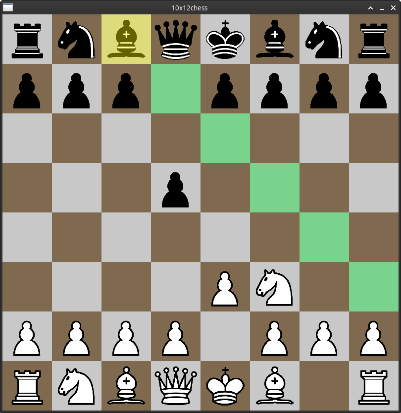

# 10x12chess

A mailbox chess engine written in c

## Description

a chess engine with the [10x12 board representation](https://www.chessprogramming.org/10x12_Board) written in c with a raylib gui

## Getting Started

### Dependencies
  
* Linux or Windows 10 (for now not tested)
* gcc and make
* [raylib](https://github.com/raysan5/raylib/wiki/Working-on-GNU-Linux)

### compiling

* got in the project folder
* run `make` in the terminal

### Executing program

* got in the project folder
* got in `/bin` folder
* run `./10x12chess` in the terminal or double click with the mouse

## Help

sas

## Authors

Fabio Murer  

## Version History

* 0.0
    * work in progress

## License

This project is licensed under the GNU GENERAL PUBLIC LICENSE Version 3, 29 June 2007 License - see the LICENSE.md file for details
